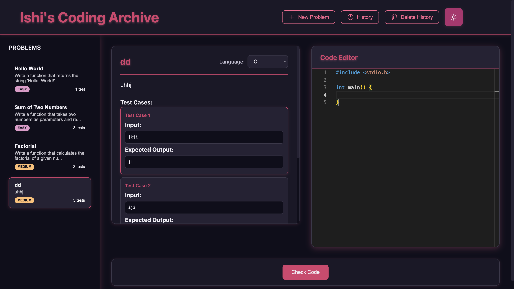

**on-going project**

# Personal Coding Platform (a coding archive) 

This is my own little coding playground built just for me. It lets me create problems, solve them in a built-in editor, run test cases,
and keep track of my submissions. Basically, it’s where I practice coding the way I want to.

**Note**: This is a frontend-only application. 

## Features  

- para isa ra akong ganahan e code for departmentals study :> 
- Create, edit, and organize custom coding problems  
- Built-in code editor (Monaco). 
- Run code against test cases to check solutions  
- Dark/light mode toggle with a clean minimalist design  
- Submission history stored locally in the browser

## Restrictions:
- no problem deletion YET!
- can't delete submission history one by one Yet!
- can't reorder the problems for personalization
- ambot unsa pa kay para nako raman ni so :p
  
**credit:** used SVG icons from heroicon.com

## Tech Stack  

- **HTML**, **CSS**, **JavaScript**  
- **Monaco Editor** for coding  
- **Local Storage**



### Styling Changes

Uses CSS variables for easier customization:

```css
:root {
    --bg-primary: #ffffff;
    --text-primary: #212529;
    --accent-color: #000000;
  
}
```


